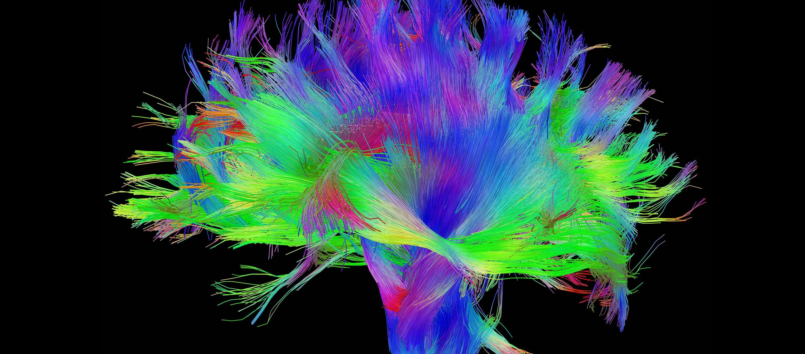

# Brainlab-DTI-Analysis

This is a code base to analyise DTI raw files and create DTI objects for fusion in Brainlab.


(credit Human Brain Project https://www.humanbrainproject.eu)
 
Please ensure you have downloaded Github desktop on your computer. This script can either be run locally or in a venv.  For either method, navigate to the folder on your computer where you want to save the code.  Once you have done this, open a terminal in that location and run the following command:

```python
git clone https://github.com/oscarlally/Brainlab-DTI-Analysis
```

If you already have python locally and want to run the codebase locally, make sure you are in the folder where the previous step has downloaded the Github repository and run this command:

```python
pip3 install -r requirements.txt
```

If you want to do this via a virtual environment, navigate to the project directory and run the below commands.  However, you may need to do some rejigging of the paths as (FSL in particular) does not interact very well with a python virtual environment:

```python
python3 -m venv venv

source venv/bin/activate

pip3 install -r requirements.txt
```

To install the dependencies and run this code in a virtual environment.

However, for the code to run, FSL, and MRtrix3 need to be installed on your local computer.  The instructions to download these two pieces of software can be found here:

[https://github.com/MRtrix3/mrtrix3](https://www.mrtrix.org/download/)
&
[https://github.com/fithisux/FSL](https://fsl.fmrib.ox.ac.uk/fsl/fslwiki/FslInstallation)

To run this script, navigate to the directory that you have saved this code in (usually /Users/yourname/Github/Brainlab-DTI-Analysis), and run the following command:

```python
python3 main.py
```
